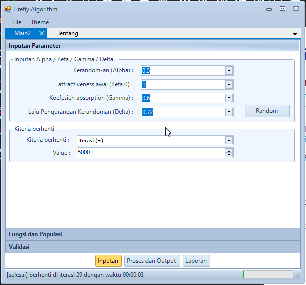
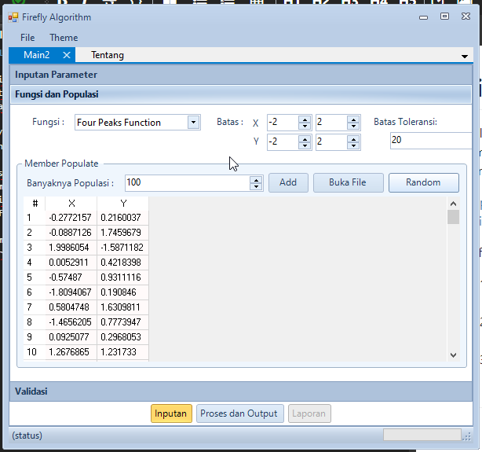
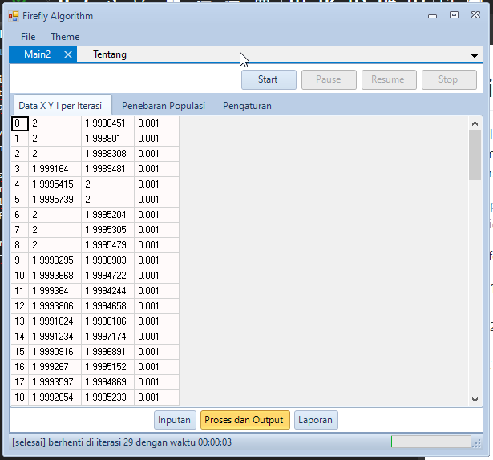
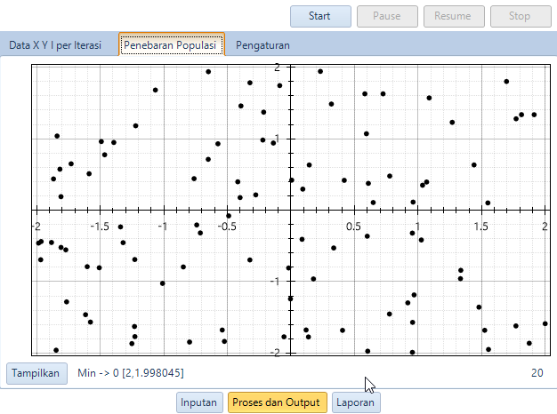

# Firefly algorithm Simulator

Aplikasi ini dibuat untuk memenuhi tugas UAS untuk matakuliah Sistem Optimasi, dimana tugasnya membuat simulasi sebuah algoritma heuristik atau metaheuristic pada persamaan goldstein-price, bohachevsky 1/2/3 dan four peak function.

Teori dan perancangan algoritmanya berdasarkan file matlab yang dibuat oleh pembuatnya yaitu Xin-She Yang, bisa dilihat link berikut ini :
- https://www.mathworks.com/matlabcentral/fileexchange/29693-firefly-algorithm?s_tid=prof_contriblnk

Referensi Mengenai Algoritma Optimasi (Metaheuristic) :
1. A comprehensive review of firefly algorithms, by Iztok Fistera, Iztok Fister Jr.a, Xin-She Yang, Janez Bresta, 23 December 2013
2. Firefly Algorithm: Recent Advances and Applications, by Xin-She Yang, 18 Agustus 2013
3. Swarm Intelligence and Bio-Inspired Computation An Overview, Xin-She Yang, 2013 Elsevier Inc.

Screenshot:

Semoga berguna buat yang sedang memperlajari matakuliah sistem optimasi.